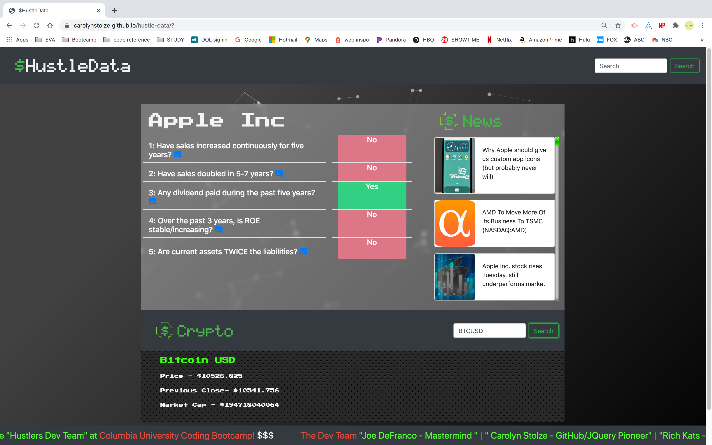

        


# (MVP)

LIVE SITE:
https://carolynstolze.github.io/hustle-data/

GITHUB REPOSITORY:
https://github.com/carolynstolze/hustle-data


- - -
- - -

- ## Have you ever been interested in the stock market?
- ## Does someone you know have interest in the stock market? 
- ## Do you want to make smart easy investments without all the hassle of doing the research?
## We believe everyone should have the power to invest. We are here to provide that power for everyone! 
To do this, we created various questions that use historical financial data that answers company specific stock market questions with a simple “yes” and “no” displayed on one dashboard.


WHAT: Stock market historical data

WHY: Using stock market historical data and studying specific examples from the stock market past make it easier to put current market moves in context, while making informed decisions for success.

WHO: Anyone interested in stock market historical data.

- - -
- - -


## How to Use

```
• Find a company you are interested in and search for that company by stock 
symbol. Your search results will show answers to questions that identify 
specific areas that are important to the understanding of the company. 
    • Each question will come back green or red. Green means yes, red means no.
    • The more green (yes) the less risky the investment is.
• You'll also see articles related to the company you searched for in the News section.
• Scroll down the page and search for Cryptocurrency as well. Search by ticker name.
```

## More to Come

```
• More question and answers on search result dashboard
• User account creation
• Share buttons (Text, pdf & excel download, email)
• Provide real time data
• Allow stock trading
• Expansion into other indices and commodities
• FAQ's
```

## Credits

- <b>Joe “Mastermind “ DeFranco</b> ||| Application concept & JS development
- <b>Adriana “Styling Queen“ Soler</b> ||| UI design and development
- <b>Rich “Coder Genius” Katznelson</b> ||| JS development
- <b>Carolyn “Ringleader” Stolze</b> ||| JS development & project manager


---
---
*Special thanks to the $HustleData team for great teamwork and collaboration.
